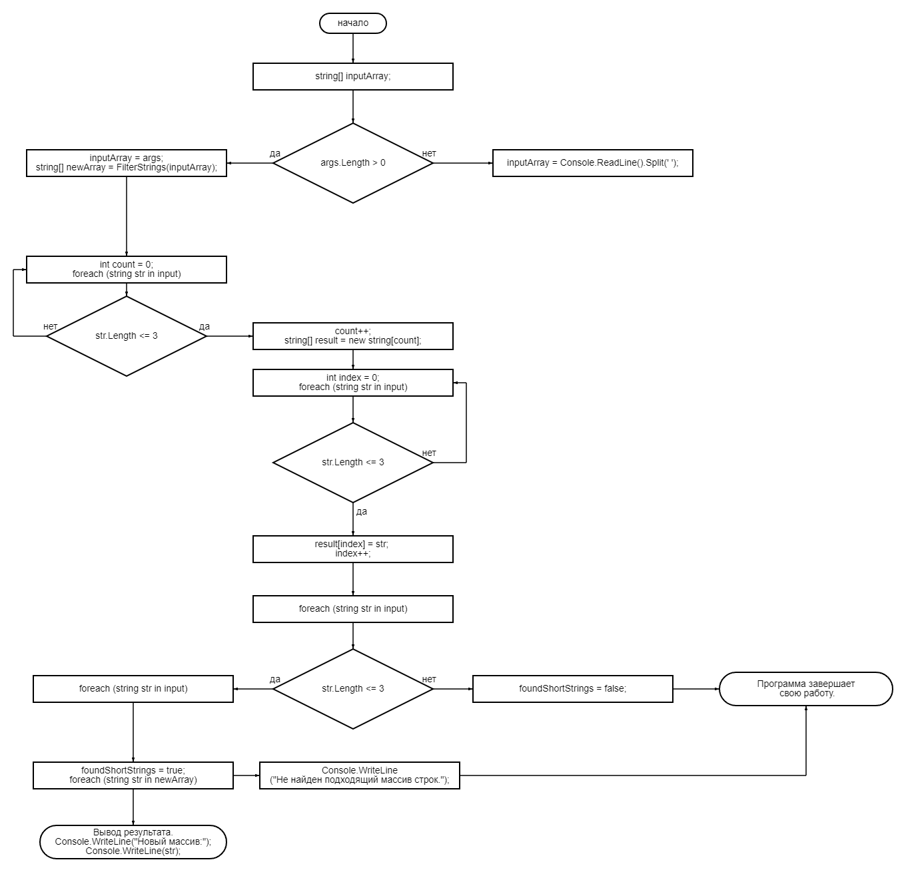

# Программа для фильтрации строк

Эта программа на C# фильтрует массив строк, чтобы создать новый массив, содержащий только строки длиной не более 3 символов.

## Использование

1. **Компиляция программы:** Скомпилируйте программу, выполнив следующую команду в вашем терминале или командной строке:

    ```bash
    dotnet Program
    ```

2. **Запуск программы:** Вы можете запустить программу с аргументами командной строки или без них.

    - **С аргументами командной строки:** Передайте строки в качестве аргументов командной строки при запуске программы. Например:

           ```bash
           dotnet run apple 123 2 :-) kiwi привет
           ```

    - **Без аргументов командной строки:** Если аргументы командной строки не предоставлены, программа запросит вас ввести строки с клавиатуры, разделяя их пробелами.

           ```bash
           Введите строки через пробел:
           ```
         
3. **Просмотр результата:** Программа выведет новый массив, содержащий строки длиной не более 3 символов.

## Пример

### Ввод

Если вы запустите программу с помощью следующей команды:

```bash
dotnet run apple 123 2 ":-)" kiwi привет
```
Программа выведет:
```
123 
2 
:-)
```
### Как это работает?
# Описание работы скрипта

1. **Подключение необходимых библиотек**: В начале скрипта происходит подключение пространства имен `System`, которое предоставляет доступ к базовым классам и структурам для работы с платформой .NET.

2. **Определение функции `Main`**: Это основная функция, которая является точкой входа в программу.

3. **Инициализация переменных**: Создается переменная `inputArray` для хранения введенных строк.

4. **Проверка аргументов командной строки**: Проверяется, переданы ли аргументы командной строки при запуске программы. Если они есть, они используются в качестве исходного массива строк. В противном случае пользователю предлагается ввести строки с клавиатуры.

5. **Получение нового массива строк**: С помощью функции `FilterStrings` создается новый массив строк, содержащий только строки длиной не более 3 символов.

6. **Проверка длины строк в новом массиве**: Проверяется, были ли найдены строки длиной более 3 символов в новом массиве.

7. **Вывод нового массива на экран**: Если в новом массиве найдены строки длиной не более 3 символов, он выводится на экран. В противном случае выводится сообщение "Не найден подходящий массив строк.".

8. **Определение функции `FilterStrings`**: Эта функция принимает массив строк в качестве входных данных и возвращает новый массив, содержащий только строки длиной не более 3 символов. Она использует два цикла `foreach` для подсчета количества подходящих строк и заполнения нового массива.


### Блок-схема

